# Pokemon - Data Lovers
*Ana Paula Araújo & Lays Marie Hidani*

## Índice

* [Definição do produto](#definição-do-produto)
* [Personas](#personas)
* [Planejamento e design sprint](#Planejamento-e-design-sprint)
* [Protótipo](#protótipo)
    * [Protótipo inicial](#protótipo-inicial)
    * [Protótipo final](#protótipo-final)
* [Testes de usabilidade](#testes-de-usabilidade)
* [Evolução do desenvolvimento](#Evolução-do-desenvolvimento)
* [Checklist](#checklist)

[Link da aplicação](https://hlays.github.io/data-lovers/)

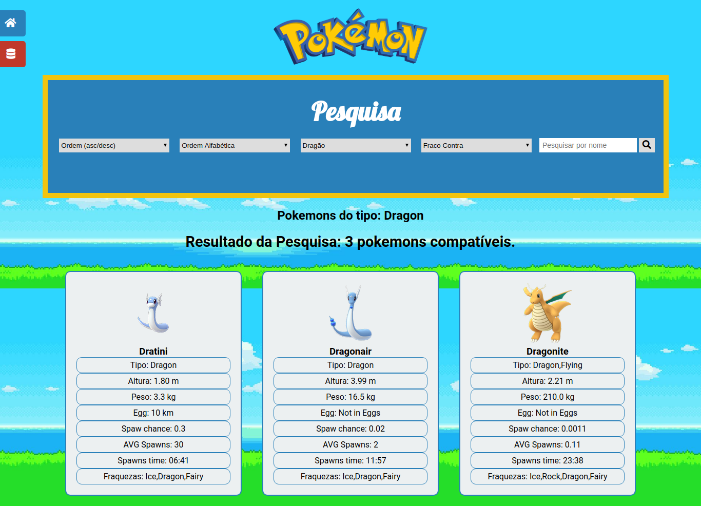
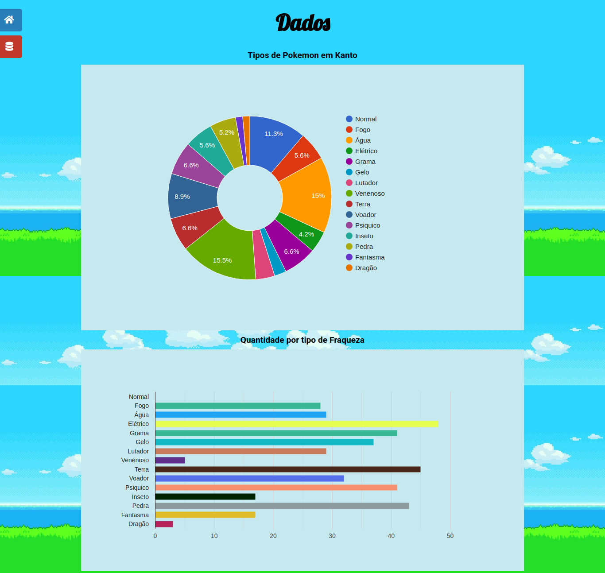

## Definição do produto

**Pokemon - Data Lovers** é uma ferramenta de busca de Pokemons da região de Kanto, onde é possível fazer buscas em ordem alfabética, por letra inicial, por nome, tipo e fraquezas. 

O objetivo da aplicação é oferecer uma interface simples e intuitiva que possa proporcionar ao usuário uma ferramenta de pesquisa e consulta que traz informações relevantes sobre Pokemons.

O banco de dados foi criado principalmente para todos os jogadores de Pokemon Go que já conhecem os personagens, querem lutar em um ginásio e não sabem qual pokemon utilizar. Também foi criado para fãs do anime em geral, e para quem quiser saber mais informações sobre os pokemons.

## Personas

## Planejamento e design sprint

**Sprint 1**
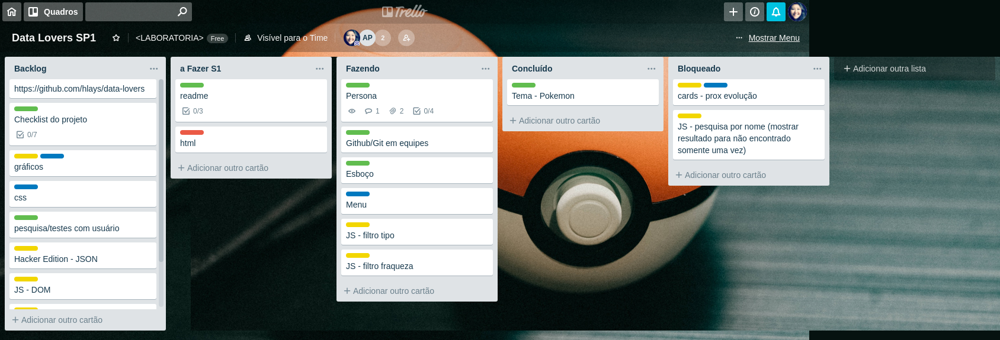

**Sprint 2 - final**
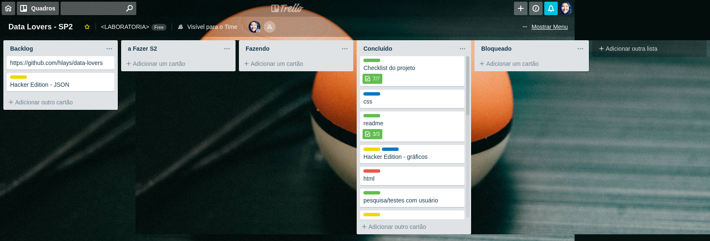

## Protótipo

### Protótipo inicial
O protótipo inicial completo pode ser conferido neste link:
[Marvel](https://marvelapp.com/6db8fdf)
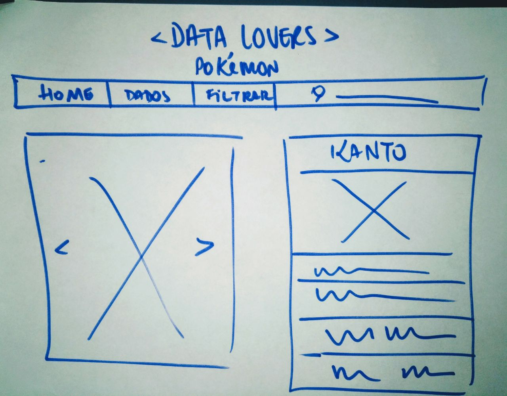
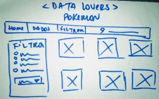

### Protótipo final
O protótipo final completo pode ser conferido neste link:
[Marvel](https://marvelapp.com/4g5f44g/screen/54253390)
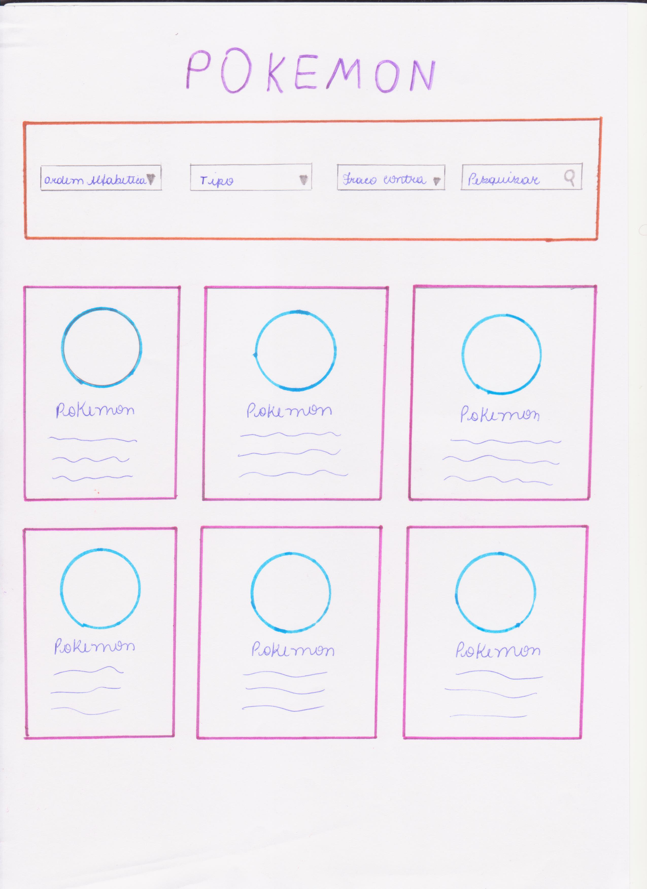
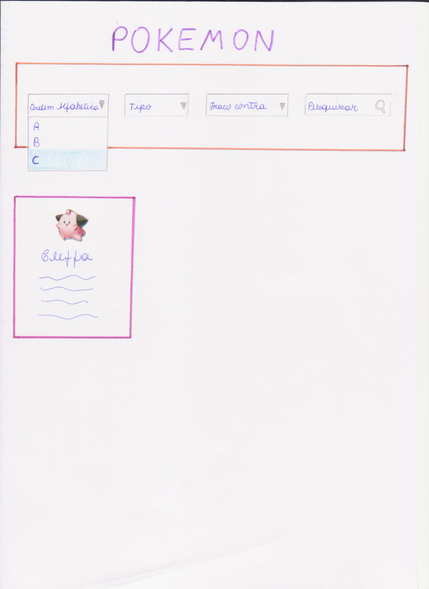

## Testes de usabilidade
Foram realizados testes de usabilidade, onde foram detectados alguns problemas que foram corrigidos para a versão final da aplicação:
* **Acesso aos filtros**: à princípio a aplicação apresentava uma tela inicial e menu para acessar os filtros. Foi identificado que seria mais eficiente se os filtros já estivessem disponíveis na primeira tela.
* **Elementos desnecessários na primeira tela**: todos os elementos desnecessários foram retirados, deixando na primeira tela, além dos filtros de pesquisa, já listados todos os 151 pokémons de Kanto.
* **Pokemons - apenas imagens**: a ideia inicial seria exibir, após a pesquisa, as imagens dos pokemons correspondentes e ao clicar em cada imagem seria redirecionado à um card com informações sobre o pokemon. No entanto, verificou-se ser mais eficiente e claro, exibir os cards já com informações quando realizada a pesquisa.

## Evolução do desenvolvimento

Primeiro layout, com menu de filtro aninhado no menu principal:

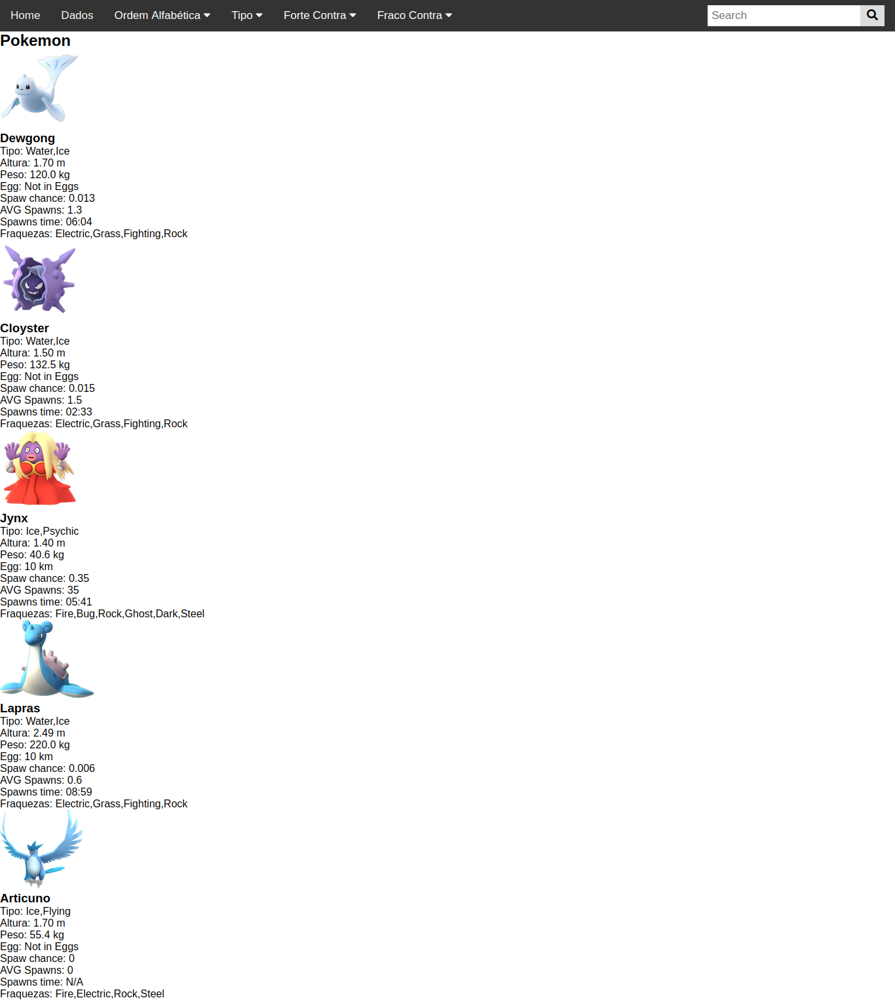

Novo menu, com foco nos filtros de pesquisa:

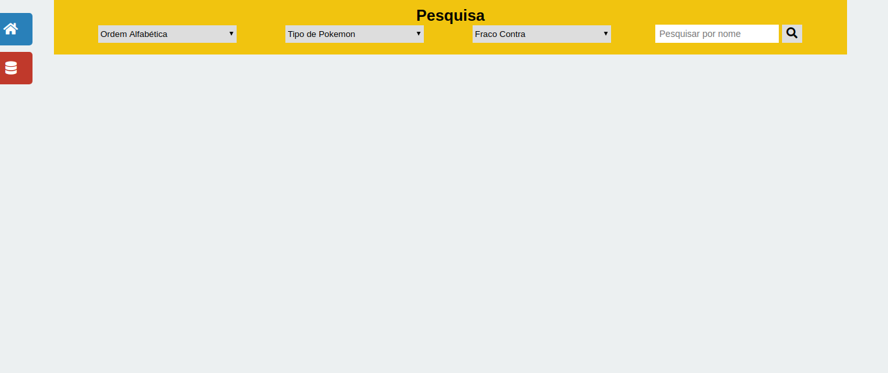

Inclusão de filtro de pesquisa de A-Z e Z-A e algumas melhorias no design:

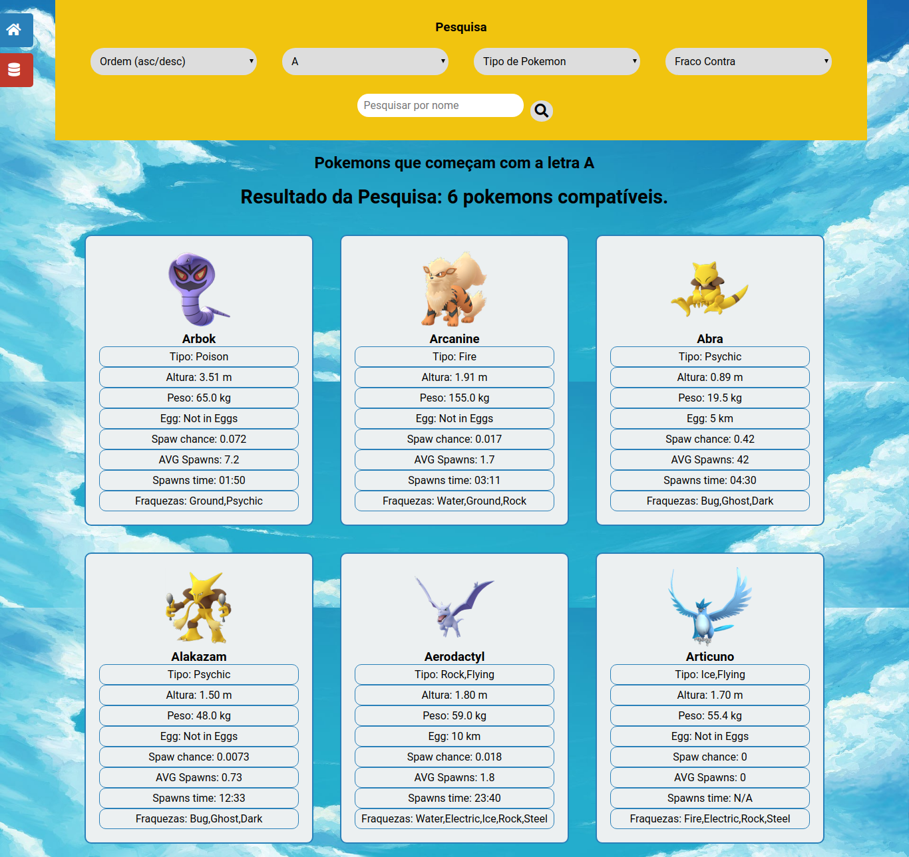

Layout final:

## Checklist

* [x] Usar VanillaJS.
* [x] Inclui _Definição de produto_ clara e informativa no `README.md`.
* [x] Inclui esboço da solução (protótipo de baixa fidelidade e de alta fidelidade, se houver) no
  `README.md`.
* [x] Inclui a lista de problema detectados através dos testes de usabilidade
  no `README.md`.
* [x] UI: Mostra lista e/ou tabela com dados e/ou indicadores.
* [x] UI: Permite ordenar os dados por meio de um ou mais campos
  (asc e desc).
* [x] UI: Permite filtrar os dados com base em uma condição.